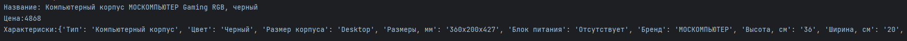
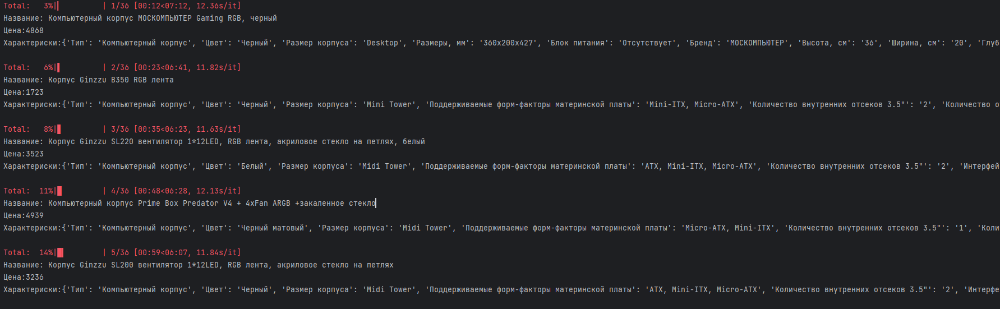

### ozon-parser

#### Библиотеки
* beautifulsoup4
* selenium
* tqdm


#### Описание
Простой парсер написанный на Selenium для парсинга товаров с интернет-магазина ozon.ru<br>
Может принимать как ссылку на один товар так и на результат поиска или страницу продавца.<br>
Команда запуска:
```python
Selenium().parse('url')
```
Выдает результат в формате:
```python
Наименование: "Полное название товара"
Цена: "Стоимость без карты ozon в int"
Характеристики: "Словарь с характеристиками"
```
Пример вывода:


При указании ссылки на список товаров(страница продавца или результат поиска)<br>
Выдает результат с прогресс баром tqdm
